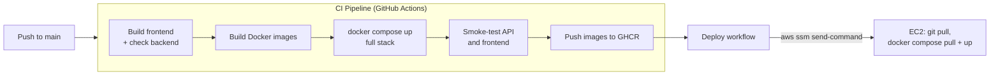

# StrataDesk

StrataDesk is a full-stack web app for managing borewell data: import drilling logs from Excel, see the borewells on a map, and draw geological cross-sections between them. It is the web predecessor of the [Strata](https://github.com/Mehulsri07/StrataField) desktop ecosystem, refactored from an early vanilla JavaScript prototype.

It is also where I practised running a small production stack end to end: containerised services, a CI pipeline that tests the whole stack before shipping, automated deployment to AWS EC2, monitoring, and load testing.

## Features

- **Excel import** of borewell logs (SheetJS), with the parsed layers stored in PostgreSQL.
- **Map dashboard** (Leaflet) showing every borewell and its details.
- **Cross-section engine** that interpolates soil layers between selected borewells and draws them as a geological section.
- **REST API** (Node.js/Express) for borewell CRUD, protected by a Bearer API token, plus `/api/health` and Prometheus `/api/metrics` endpoints.

## Tech stack

| Layer | Tools |
|---|---|
| Frontend | React 19, TypeScript, Vite, Tailwind CSS, shadcn/ui, Zustand, TanStack Query, Leaflet, Recharts |
| Backend | Node.js, Express, PostgreSQL 17 |
| Packaging | Docker, Docker Compose, Nginx (serves the frontend), GitHub Container Registry |
| CI/CD | GitHub Actions, AWS Systems Manager (SSM), AWS EC2 |
| Observability | Prometheus, Grafana, Node Exporter, Postgres Exporter, Uptime Kuma |
| Load testing | k6 (baseline, moderate, heavy, read/write-heavy, chaos and recovery scenarios) |

## CI/CD pipeline



1. **CI** (`.github/workflows/ci.yml`) builds the frontend and backend, builds both Docker images, starts the entire stack with Docker Compose, waits for it to become healthy, and tests the API and frontend. Only if everything passes are the images pushed to GHCR.
2. **Deploy** (`.github/workflows/deploy.yml`) runs after a successful CI run on `main`. It uses AWS SSM to tell the EC2 instance to pull the new images and restart the stack, so no SSH port needs to be open.

## Running locally

```bash
git clone https://github.com/Mehulsri07/StrataDesk.git
cd StrataDesk
cp .env.example .env    # then change the tokens and passwords
docker compose up -d --build
```

| Service | URL |
|---|---|
| App | http://localhost |
| API | http://localhost:3001 |
| Uptime Kuma | http://localhost:3002 |

To work on the frontend alone with hot reload:

```bash
npm install
npm run dev
```

## Load tests

The `load-tests/` folder has k6 scenarios from a gentle baseline up to chaos and recovery tests. `run-all.ps1` runs them in order while `capture-docker-stats.ps1` records container CPU and memory, and `load-test-report-template.md` is the template for writing up the results.

```bash
k6 run -e BASE_URL=http://localhost:3001 -e AUTH_TOKEN=<your API_TOKEN> load-tests/01-baseline.js
```
